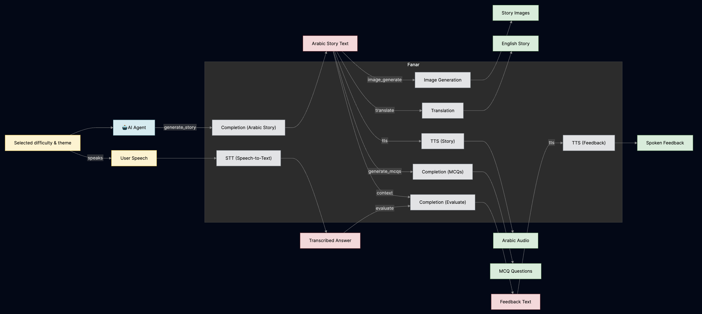

# حكايات (Hikayat) — The AI-Powered Arabic Storytelling Universe for Kids

Welcome to **Hikayat** — where the magic of AI meets the timeless art of Arabic storytelling! Hikayat is a next-generation, interactive platform designed to ignite curiosity, foster learning, and celebrate the rich heritage of the Arab and Islamic world. Built for children, parents, and educators, Hikayat transforms reading into an immersive, playful, and deeply educational adventure.

---

## ✨ What is Hikayat?

Hikayat (حكايات) is an AI-driven digital playground for young minds. It crafts beautiful, personalized stories in Arabic (with English translations), complete with:
- **AI-generated narratives** tailored to your child's interests and reading level
- **Stunning illustrations** created by generative AI
- **Natural audio narration** in Arabic
- **Interactive quizzes** and comprehension games
- **Progress tracking** and rewards
- **A whimsical, child-friendly design** inspired by Arabic and Islamic art

All powered by state-of-the-art language and image models, with a mission to make learning fun, accessible, and culturally relevant.

---

## 🧠 Why Hikayat? (Our Mission)

- **Empower the next generation** with stories rooted in their language and culture
- **Harness AI for good**: personalized, adaptive, and always fresh content
- **Bridge worlds**: Bilingual support for Arabic and English
- **Make reading magical**: Every session is a new adventure!

---

## 🌟 Features at a Glance

- **AI Story Generation**: Unique, age-appropriate stories every time, powered by Fanar LLM
- **AI Illustrations**: Each page comes alive with custom, generative art
- **Text-to-Speech**: Listen to stories in beautiful, natural Arabic
- **Bilingual Mode**: Instantly switch between Arabic and English
- **Adaptive Difficulty**: Beginner, Intermediate, and Advanced reading levels
- **Theme Explorer**: Choose from 8+ magical themes or invent your own
- **Interactive Quizzes**: Test comprehension with AI-generated questions
- **Progress & Rewards**: Earn points, unlock badges, and track growth
- **Child-Safe Design**: No ads, no distractions, just pure learning fun
- **Mobile-First**: Gorgeous on phones, tablets, and desktops
- **Accessibility**: Designed for all children, with special attention to usability

---

## 🖼️ System Architecture

*Above: Hikayat's AI-powered story engine, quiz generator, and multimedia pipeline.*

---

## 🎨 Themes & Adventures

- **🌙 Ramadan**: Spiritual journeys and festive tales
- **👨‍🍳 Cooking**: Culinary adventures with traditional recipes
- **🕌 Mosques**: Stories of community and wonder
- **🐪 Animals**: Fables from the animal kingdom
- **👨‍👩‍👧‍👦 Family**: Heartwarming bonds and traditions
- **🌿 Nature**: Exploring the beauty of creation
- **🤝 Friendship**: Kindness, empathy, and helping others
- **🗺️ Adventure**: Magical lands and daring quests

---

## 🚀 Quickstart Guide

For full setup and development instructions, see [`hikaya/README.md`](hikaya/README.md).

---

## 🧩 Design System

- **Colors**: Warm browns, forest greens, golden accents, and cozy beiges
- **Typography**: Amiri (Arabic), Noto Sans Arabic (English)
- **Animations**: Smooth transitions, playful micro-interactions
- **Accessibility**: Large touch targets, readable fonts, ARIA support

---

## 🗺️ User Journey

1. **Welcome**: Magical landing page with call-to-action
2. **Setup**: Pick a theme and reading level
3. **Storytime**: Read, listen, and explore interactive stories
4. **Quiz Time**: Test your knowledge and earn rewards
5. **Celebrate**: See your progress and unlock new adventures

---

## 🚀 Deployment

- Vercel (Recommended)
- Netlify, Railway, DigitalOcean, AWS Amplify, and more

---

## 🤝 Contributing

We ❤️ contributors! Whether you're a developer, designer, educator, or parent, your ideas can help shape the future of Arabic children's education.

1. Fork the repo
2. Create a feature branch
3. Commit and push your changes
4. Open a Pull Request

---

## 📝 License

MIT License — see [`hikaya/LICENSE`](hikaya/LICENSE)

---

## 🙏 Acknowledgments

- **Fanar LLM** for AI magic
- **Google Fonts** for beautiful typography
- **Cultural inspiration** from the Arab and Islamic world
- **All children, parents, and educators** who believe in the power of stories

---

## 📞 Support & Community

- Email: support@hikayat.com
- Join our Discord (coming soon!)

---

Made with ❤️, AI, and a love for stories.